# MachineFi Runtime

[](https://github.com/Machine-Fi/runtime/actions/workflows/ci.yml)
[](https://www.npmjs.com/package/@machinefi/runtime)
[](LICENSE)


MachineFi Runtime is the public TypeScript SDK and CLI for wallet-linked autonomous machines: robot arms, drones, sensors, rovers, warehouse bots, and DePIN/edge hardware. It gives developers inspectable building blocks for machine identity, capabilities, job lifecycle, telemetry snapshots, policy decisions, unsigned settlement intents, work proofs, and receipt verification.

Solana and Robinhood rails sit underneath the machine runtime as settlement, proof, and audit infrastructure. The broader MachineFi Robotics platform handles production orchestration, hardware integrations, private provider routing, treasury controls, and closed-core policy services outside this repository.

## GitHub milestones

MachineFi Runtime progressed through early GitHub builds from `v0.1.0` to the current `v0.9.4` stable npm release. Earlier milestones are available as Git tags for implementation history and package-readiness review.

MachineFi Runtime began with Solana and generic machine-runtime interfaces, then added EVM-compatible abstractions. Robinhood testnet support follows the public testnet track, and Robinhood mainnet examples are documented only after Robinhood Chain mainnet launched on July 1, 2026. Developers should use the latest npm package version for current Robinhood Chain behavior.

## What this repo exposes

- Machine identity and capability models for robots, drones, sensors, and edge nodes.
- Job/task lifecycle helpers from creation through proof submission and settlement linkage.
- Telemetry/status snapshot validation for battery, health, signal, progress, and optional location/pose data.
- Public-safe policy decisions for machine work acceptance and settlement limits.
- Unsigned caller-wallet settlement intents; no private keys, custody, autonomous signing, or broadcast.
- Source-aware receipt evidence across Solana and Robinhood rails, including chain checks, transaction/log/balance evidence, fixture/envelope labeling, and expectation mismatch reasons.
- Fixture-mode CLI and examples for robot job lifecycle, drone inspection settlement, and sensor data payment.

## What builders can inspect

| Surface | Files | What to look for |
| --- | --- | --- |
| Machine identity and sessions | [`src/machines`](src/machines), [`src/session.ts`](src/session.ts), [`docs/runtime-sessions.md`](docs/runtime-sessions.md) | roles, capabilities, pairing records, runtime session shape |
| Work lifecycle and telemetry | [`src/jobs`](src/jobs), [`src/telemetry`](src/telemetry), [`docs/machine-runtime.md`](docs/machine-runtime.md) | work stages, telemetry normalization, policy gates |
| Settlement intents | [`src/settlement`](src/settlement), [`docs/settlement-intents.md`](docs/settlement-intents.md) | unsigned caller-wallet intent records and decimal/base-unit validation |
| Receipt verification | [`src/adapters`](src/adapters), [`docs/receipt-verification.md`](docs/receipt-verification.md) | Solana and Robinhood source-aware receipt evidence and mismatch reasons |
| CLI and fixtures | [`src/cli`](src/cli), [`fixtures`](fixtures), [`tests`](tests) | deterministic runtime checks used by CI and examples |

## Install

```bash
npm install @machinefi/runtime
npx machinefi status --chain solana --fixture
npx machinefi status --chain robinhood --fixture
```

## Machine-first examples

```bash
npx machinefi pair --chain solana --fixture --machine-id drone-9 --wallet 11111111111111111111111111111111 --operator flight-ops
npx machinefi intent build --chain robinhood --source 0x1111111111111111111111111111111111111111 --recipient 0x2222222222222222222222222222222222222222 --amount 1.25 --machine-id robot-arm-17 --session-id session-1 --fixture
npx machinefi verify --chain solana --signature 5HueCGU8rMjxEXxiPuD5BDuRaRj1hUXQG48GhYnjmQumooWcT3Yr4v7e1i4bnzK7t1Q7Fxx4E2VPu7Y9xV1r5fq --fixture --from 11111111111111111111111111111111 --to Sysvar1111111111111111111111111111111111111 --amount 0.5 --machine-id drone-9 --session-id mfi_solana_fixture_session
```

Executable examples are included under `src/examples/`:

- `robot-job-lifecycle.ts` — robot arm session, capability policy, unsigned intent, and work proof linkage.
- `drone-inspection-settlement.ts` — drone telemetry, Solana settlement intent, and receipt expectations.
- `sensor-data-payment.ts` — edge sensor data job, policy decision, and proof metadata.

## Runtime flow

```mermaid
flowchart LR
  Developer[Developer / operator]
  Machine[Machine identity]
  Session[Runtime session]
  Work[Work order]
  Telemetry[Telemetry snapshot]
  Policy[Policy decision]
  Intent[Unsigned settlement intent]
  Wallet[Caller wallet / provider flow]
  Receipt[Receipt evidence]
  Proof[Work proof record]

  Developer --> Machine
  Machine --> Session
  Session --> Work
  Work --> Telemetry
  Telemetry --> Policy
  Policy --> Intent
  Intent --> Wallet
  Wallet --> Receipt
  Receipt --> Proof
```



1. Register a machine identity with role, capabilities, wallet/account, and operator.
2. Pair a rail-specific runtime session.
3. Create a job with required capabilities and settlement terms.
4. Normalize telemetry/status snapshots.
5. Evaluate policy before accepting work.
6. Build an unsigned caller-wallet settlement intent.
7. Link telemetry/result references to a work evidence bundle.
8. Verify Solana or Robinhood receipt evidence as settlement/proof records, with native chain fields separated from MachineFi envelope or fixture metadata.

## Live mode

Live-read mode uses caller-supplied provider endpoints such as `MACHINEFI_SOLANA_RPC_URL`, `MACHINEFI_ROBINHOOD_RPC_URL`, or `--rpc-url`. Fixture mode is deterministic for CI and examples.

## Public boundary

This repository is the public runtime interface layer. It does not include production robot-control drivers, production backend routing, private provider operations, private policy engines, treasury movement, private keys, seed phrases, or the production frontend.
