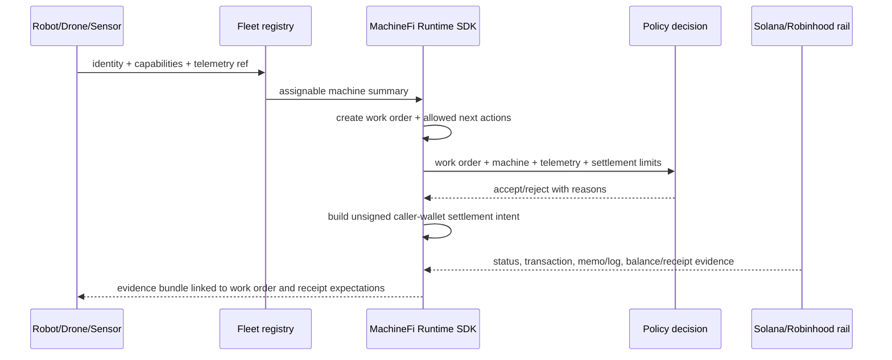

# Architecture

MachineFi Runtime is the public interface layer for autonomous machine work. Solana and Robinhood are settlement/proof rails below that runtime, not the whole product.

## Public layers

- Machine identity, capabilities, and fleet registry state.
- Work-order lifecycle and telemetry evidence references.
- Policy decisions for whether work can be accepted.
- Unsigned settlement intents owned by caller wallets.
- Source-aware receipt verification and work evidence bundles.
- CLI and deterministic fixture mode for examples and CI.

## Closed-core boundary

The repository does not include production robot-control drivers, autonomous signing, private keys, treasury movement, backend routing, production provider operations, or the production website/frontend implementation.

## Finality and settlement limit helpers

Receipt adapters share finality helpers for provider-derived confirmations and Solana status normalization. Settlement policy helpers convert validated decimal strings to base units before comparing machine-job limits, so examples and policy checks use the same caller-wallet boundary as the runtime adapters.
